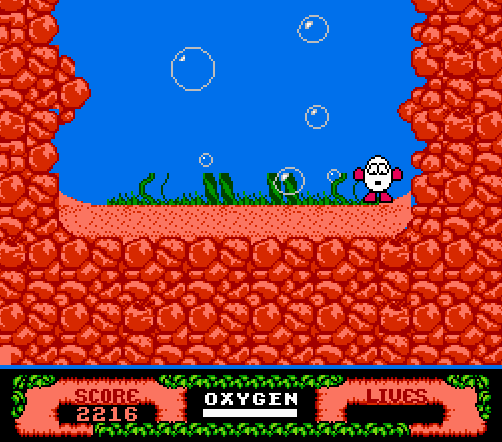
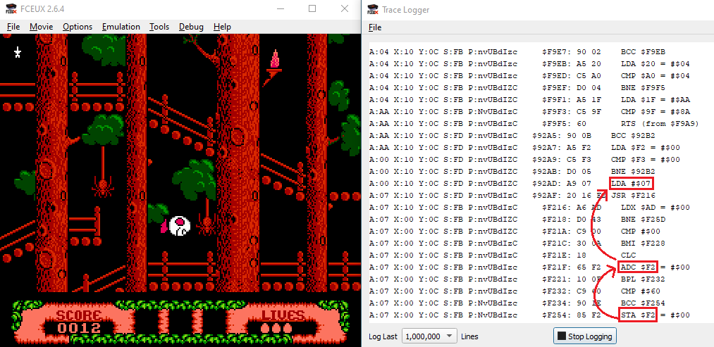
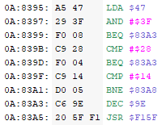
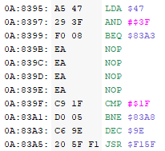

# The Fantastic Adventures of Dizzy: Fair Edition

  

The Fantastic Adventures of Dizzy: Fair Edition is a patch which I created for the NES game The Fantastic Adventures of Dizzy (FAoD). The patch includes several (relatively) simple changes to make the game significantly less tedious. It also fixes a few bug (one of which is especially heinous). With this patch, what was once a nearly impossible game becomes a fun, novel experience which ranks among other classic NES titles.

Change Summary:
 * Dizzy has better temporary invincibility after taking damage (i-frames).
 * Dizzy starts the game with one extra life
 * Spiders do less damage and move in predictable patterns
 * Birds/Bats do less damage and move in (more) predictable patterns
 * Ants/mice do less damage, and mice in the sewers move in (more) predictable patterns
 * Guillotines in the town move in predictable patterns
 * Damage from torches, lava bombs, Triceratops, and Leprechaun are all reduced
 * Added more frames to jump on the log that comes down the waterfall between the town and Yolkfolk tree-village. 
 * Reduced how quickly the Oxygen meter goes down during the bubble mini-game
 * Removed an especially tedious raindrop in the graveyard near the end of the game
 * Fixed a bug where the last star can be collected twice, which soft-locks the player at the very end of the game
 * Removed the (partial) invulnerability glitch
 * Fixed a glitch were lower-priority items are displayed instead of high-priority items (e.g. the star-plant object had priority over the plank object)

 (These changes will be addressed in further detail)

This README documents how to install the patch to your copy of FAoD, as well as what changed with examples. It also includes a lot of technical details of what was changed and how, featuring plenty of 6502 Assembly code. These notes are largely for my own benefit, but those curious about how the sausage is made will certainly get a mouthful.

# Table of Contents
1. [Installation](#installation)
1. [Why The Patch Was Created](#why)
    1. [Background](#background)
    1. [On "Fixing" the game](#fixing)
1. [What Was Changed](#them_changes)
    1. [What Was Not Changed](#not_changed)
    1. [Changes to Dizzy](#dizzy_changes)
    1. [Changes to Enemies](#enemy_changes)
    1. [Environmental Changes](#envt_changes)
    1. [Bug Fixes](#bug_fixes)
1. [How It Was Changed](#how_changes)
    1. [How Dizzy Was Changed](#how_dizzy)
    1. [How Enemies Were Changed](#how_enemies)
    1. [How The Environment Was Changed](#how_environment)
1. [Conclusion](#conclusion)

## **Installation**  
To install the patch, follow these steps:
* Have a copy of the Fantastic Adventure of Dizzy .NES file (*These steps will overwrite the existing file, so make sure to copy the original if you wish to have a vanilla version of the ROM*)
* Download the patch `TheFantasticAdventuresOfDizzy_Fair.ips` from this repository [(link)](https://github.com/schil227/FantasticAdventuresOfDizzyFair/blob/main/TheFantasticAdventuresOfDizzy_Fair.ips).
* Download [Lunar IPS](https://www.romhacking.net/utilities/240/), a program which can be used to apply the patch
* Run Lunar IPS
    * Select "Apply IPS Patch"
    * Locate the TheFantasticAdventuresOfDizzy_Fair.ips file
    * Next, Locate the vanilla Fantastic Adventure of Dizzy .NES file (again, I suggest making a copy beforehand)
* Load the newly-patched ROM (.NES file) into your emulator of choice.

## **Why The Patch Was Created** 

This section explains why the patch was created, including some (non-technical) design analysis.

### **Background** 
It's amazing just how great FAoD is. The game-play a blend of adventure, platforming, and puzzle, which is really quite impressive. The art-style is crisp and pushes the limits of what the NES was capable of. I'll admit, while play-testing this patch, I caught myself staring at the brick walls of the town sewers; its so fascinating how they achieved the simple illusion of the wall curving as it goes up.

   
  <i>Just look at that brickwork!</i>

And, the music is some of the best in the entire NES library. I occasionally put it on in the background while I'm working - some great bopping tunes. It's a shame that (to put it harshly) they ruined the game with a few terrible choices.

As mentioned, the vanilla version of game is nearly unbeatable. Dizzy takes an absurd amount of damage from everything, and the randomness in enemy movement makes getting hit nearly unavoidable. Grinding the entire game to a halt while Dizzy waits for a spider to get out of his way, only to have it immediately come back down half-way through its ascent, is the epitome of tedium. Not to mention all the 1-hit death-traps, which can be as innocuous as a pale string to a speeding mine-cart collision.

   
  Granted, they captured the essence of what it's like to be an egg.

 It's laughable to think of just how much the game is stacked against you. Among imprecise platforming, trial-and-error obstacles, and enemy movement that requires saint-like patience, know that this is all it takes:

   
  Literally 2 seconds.

And what happens after you get game over? Back to the title screen. Given all the tasks you must perform and constant backtracking across enemy strewn areas, beating the game is a Herculean task. 

Thus we have the genesis of this patch: how can I minimally change the game such that the extreme difficulty is reduced to something more manageable, while keeping the original spirit of the game intact? In other words, if the original developers realized just how impossible the game was, what would they change?

### **On "Fixing" the game** 
Claiming that I'm "fixing" the game is certainly a strong statement, one which I do not take lightly. Game design back then was very focused on the player getting their money's worth, and critics tend to throw the phrase "bad game design" around pretty loosely. To the game's credit, yes you certainly would get your money's worth, and yes it really does feel like I'm playing an egg-simulator - however I can not turn a blind eye to some of the more questionable things about this game.

Unlike my Fair Edition patch for [Journey to Silius](https://github.com/schil227/JourneyToSiliusFair), which just skirted over the line of being unreasonable, FAoD stomps all over it. While I was looking at the code and discovered that *just touching* a spider takes away **one fifth** of your total health, I couldn't believe it. I couldn't believe that they would decide to not only throw *dozens* of spiders *just* in the starting, not only that their random movement means you'll spend five to ten seconds waiting for the spider to get all the way out of the way, but that it just lops off a huge chunk of your health. AND due to how i-frames work, you could end up getting hit multiple times! 

... I'm getting off topic. The point is, in this adventure-puzzle-platformer which takes hours to beat, that you could suddenly lose at very swiftly, I felt much more justified in making some changes. And despite my grievances with how some things were handled, I really do think this is a magical game worth the time and effort to "fix". Again, the patch does not aim to trivialize the challenge, but rather to keep the the game as close as possible to its original vision. When the player beats the patch, they should feel like they really completed a tough but (mostly) fair NES game.

## What Was Changed 

This section will contain an extravaganza of all the many changes that were done as a part of this patch. The details of these changes will stick to game-play and design, and the nitty-gritty coding details will be in the technical section. While the changes for this patch were numerous, it's also worth discussing what *wasn't* changed.

### What Was Not Changed 

**Continues: No additional continues**

 Like the [Journey to Silius: Fair Edition](https://github.com/schil227/JourneyToSiliusFair) patch, continues (or lack-thereof, in this case) are important in keeping the game challenging. While now-a-days continues are a thing of the past, they undoubtedly served the purpose of keeping the the steaks high and pressure on the player. It really adds to the formula of NES-hard game, and to the elation the player feels once they beat it.

Furthermore, there really isn't a straight-forward way to implement continues that makes sense. Maybe Dizzy could have respawned in his house, but this would've been a very large undertaking for (in my opinion) not much reward. Also had I gone this route, I probably wouldn't have addressed nearly as many of the other issues (e.g. randomness in enemy movement, etc.), since having continues would make the game significantly easier on its own.

**The Minecart Minigame: No Change**

 For what is probably the easiest way to game-over in this game, a small part of me actually enjoys the Minecart Minigame. It really adds a fast-paced splash of variety to the game which (once you 'git gud' at) is pretty great. Even though I had to play through this game like 4 times to test out this patch, every time I beat the minecart section, I felt that lovely dopamine kick.

   
  <i>White knuckle baby, YEAH!</i>

From a technical design standpoint, I don't see a lot of ways to improve it that wouldn't ruin the experience. Make it so you don't lose a life? Remove some of the enemies? Slow down the rifts that sever the tracks? Color-code the "correct" track? Make any exit lead to the end? I don't like any of these options. Fortunately it can be done very early in the game, so I would recommend going straight to it as completing it as possible.

There was a guy I went to college with, his name was Michael. He was a lanky, quite guy who grew up working on his father's farm. He was smart too - pursuing a degree in Mathematics and a minor in Computer Science. Anyways, we wound up working on a group project in class together, and I got to know him. Turns out we both loved the Nintendo 64, and we would arrange to meet at the computer lab after hours to play some Perfect Dark many times. He didn't have many games with him - but one that he did, and seemed to cherish above the others, was his copy of *Star Wars Episode 1: Racer*. I had only a passing awareness of the game, having played it (poorly) at Target and writing it off as to difficult to bother. So one day, while I'm still finishing up some work in the lab, he arrives and he hooks the N64 up to the projector. While waiting for me, he pops in SWE1:Racer and starts playing.

He was *amazing*.

It invoked a certain feeling that I haven't felt in nearly a decade; that feeling of watching your older cousin beat Ocarina of Time. That feeling of being so inept at a task you couldn't being to figure out how to accomplish it - then watching a master do it with ease. Perhaps SWE1:Racer isn't that difficult, maybe I just didn't give it a fair try. But I don't think I ever will, since it would risk tarnishing the nice memory of the best pod-racer I knew.

Anyways - I guess when I play this minecart mini-game, I feel *just a little* like Michael.

**The Clouds**:

   
  His face says it all.

I'd wager not even the above-average player would make it this far in the vanilla version of the game, but this area sucks. The cloud platforming section is thankfully not a source of many lives lost, but it's arguably one of the most tedious parts of the game. When Dizzy stands on a cloud, he slowly sinks down in it until he falls through it. This means you have to constantly be jumping in place to maintain your altitude. This wouldn't be so bad if not for all the butterflies that threaten to bop you around and reverse your controls. What's more, you have to do this section several times.

All that being said, I could have easily changed it. I could have made Dizzy sink in the clouds at a slower speed. I could have removed some of the butterflies. But this is one of the very few parts of the game that doesn't immediately bring death and dismemberment to Dizzy. To me, it serves as a reminder; a reflecting pool before the final boss - a reminder to just how tedious this game was before the patch. Therefore, it stays in unaltered.

**The Balls in Zak's Castle: No Change**

 Without spoiling the ending any further, it would be disingenuous of me to alter any part of the final encounter. That last area is pure FAoD.

### Changes to Dizzy  
These are the changes that were made to Dizzy directly

**Starting Lives: Dizzy starts with one extra life**

 I went back in forth on keeping this change in, but with how quickly lives can get snapped up, I think it's fairly benign. If anything it's a reminder to the quality assurance that went into this patch: before this I had instead opted to double the lives gained when completing the sliding puzzle mini-game. However when I ended up beating the game with like five extra lives, I figured it was ruining the economy. So it stands, one extra life.

**Invincibility Frames: Invincibility frames are doubled**

 Due to how damage works in this game, I was kinda surprised to find that Dizzy has invincibility frames (i-frames). The way it works is Dizzy get hit, for, say 10 damage. Then, Dizzy would be invulnerable to damage for 10 frames. Having a one to one ratio of damage taken vs i-frame is pretty sorry, and the result is Dizzy will typically be hit multiple times if he touches an enemy. To add to this point, since i-frames are tied to damage received, decreasing the damage enemies do makes almost no difference. For example, if Dizzy takes 5 damage, he only has 5 frames to get out of harms way.

The solution was to double the i-frames Dizzy receives after getting hit. This was done in conjunction with reducing the damage from many different sources. These two changes alone made for a much more enjoyable experience; as opposed to the ultra-aggressive-two-seconds-until-you-are-dead experience.

### Changes to Enemies 
**Spiders: Reduced damage and removed switchbacks**

| 
Base Game
 | 
Fair Edition 
 |
|---|---|
|  | |
| 
 Spiders move erratically
 | 
 Spiders move consistently up and down
|

Many enemies in the game move in a random way which I'll refer to as "switchbacks". Switchbacks happen when the enemy is seemingly moving in one direction, but then "switches back" part way through. This is most obviously seen in the spiders from the base game: the spider moves down quickly, goes up a little, but then does a fake-out and drops all the way down half way through. Dizzy does not move fast enough to dodge the spider unless it is at the very top, which means you need iron patience to *always* wait *every time* for the spider to go all the way up in the base game, or run the risk and lose 20% of your health.

This change is worth the patch alone. A large portion of the game take place in spider-infested tree labyrinth, and it's easily one of the most frustrating parts of the game. This change means that if a spider is going up, it's going up. It's not going to switch and drop halfway through, no, it's just going up. All the way up. And that's wonderful.

In addition, spider damage was reduced by about 2/3rds, meaning it takes roughly 13 hits from the spider to kill Dizzy, as opposed to the usual 5.

**Birds: Reduced damage and removed switchbacks**
| 
Base Game
 | 
Fair Edition 
 |
|---|---|
|  | |
| 
 Birds change direction frequently
 | 
 Birds only change direction when they hit an edge
|

If it's not the spiders, then it's the birds (and bats). These bastards change direction and speed frequently mid-flight, *and* they ignore i-frames! Meaning it's more or less random chance if passing by one will peck your yolk out.

Since they ignore i-frames, I reduced the damage from two per frame to one. And similar to the spiders, I removed the switch-back logic. In this case, the birds only switch direction when they bounce against the edges of their area.

   
  Big screensaver vibes

I was surprised by how effective this was; being able to see the consistent pattern made it so there was some actual game-play involved, instead of just praying not to get hit.

**Sewer Rats: Reduced damage and removed switchbacks**
| 
Base Game
 | 
Fair Edition 
 |
|---|---|
|  | |
| 
 Mice change direction frequently
 | 
 Mice only change direction when they hit an edge
|

Essentially the same problem as the birds, except it's harder to tell if they're hitting you. The solution is essentially the same as well; they only change direction when they hit the wall, and their damage has been reduced.

**Guillotine: Removed switchbacks**
| 
Base Game
 | 
Fair Edition 
 |
|---|---|
|  | |
| 
 Guillotine can drop at any time
 | 
 Guillotine only drops when it's at the top
|

Any executioner worth their salt would know that if you want to effectively kill someone, you shouldn't half-ass it. The same could be said for the rather uncomfortably common placement of Guillotines throughout the town. Instead of the frequent occurrence of misfires, now the Guillotines must reach the top before coming down. Of course, if Dizzy gets hit by one he'll still be killed - but at least you can time your movements to escape such a fate, if you're careful.

**And The Rest: Reduced damage from several other sources**

These sources include:
  * **Triceratops**: Reduced from 25 points of damage to 16
  * **Sheamus the Leprechaun**: For some reason he did a ton of damage. I reduced it to be a bit more fair, since it's not obvious he'll hurt you. Reduced from 25 points of damage to 5
  * **Fire Torches**: Also ignores i-frames, reduced to 1 point of damage per frame.
  * **Lava Rock**: Ignores i-frames, reduced from 5 points to 2 points per frame.
  * **Rats**: As in the rats not found in the sewers. Their damage was reduced from 20 to 7.
  * **Ants**: To be fair, they're quite large. Their damage was reduced from 20 to 7. 

   
  Strange looking dog.

### Environmental Changes 

Outside of Dizzy and the things which wish him harm, there were several more subtle changes that were introduced as well. These include:

**Barrel Over the Falls: Increased time to jump on the barrel**
| 
Base Game
 | 
Fair Edition 
 |
|---|---|
|  | |
| 
 Very brief window to jump on the barrel
 | 
 Slightly more generous window to jump on the barrel 
|

Even today when I encounter this jump I get a slight zap of anxiety. Given how many times you have to cross it, adding even just a few more frames makes all the difference.

**Bubble Mini-game: Slowed down how quickly oxygen decreases**
| 
Base Game
 | 
Fair Edition 
 |
|---|---|
|  | |
| 
 Oxygen meter ticks down somewhat quickly
 | 
 Oxygen meter ticks down slightly slower
|

Once you master the bubble mini-game, it's not to terribly difficult. But I guarantee the first few times you play it, Dizzy will almost certainly drown. It's a pretty cool mini-game, but a lot of mechanics are thrown at you. If you don't catch on immediately (and get lucky, frankly), it's a watery grave for Dizzy. 

In order to round out the difficulty (and upset the luck-factor), Dizzy's oxygen meter decreases 1/3 slower in the fair edition than the base game. This gives the player ample time to figure out what's going on and how the new mechanics work.

**Graveyard Cavern: Removed particularly awful raindrop**
| 
Base Game
 | 
Fair Edition 
 |
|---|---|
|  | |
| 
 Oxygen meter ticks down somewhat quickly
 | 
 Oxygen meter ticks down slightly slower
|

At the very end of the game, one of the last items you get is a trampoline - and after playing through the game four times, I can still say with confidence that I have no idea how the thing is supposed to work. But its purpose is to bounce dizzy out of a cavern, and at the only spot where you can do that is a god damn raindrop. Why - why put a raindrop *there* of all places? Why punish the player attempting to learn a new, *very obtuse* mechanic at the end of the game?

 I actually lost a life at that part, and I just couldn't stand the thought of someone getting game over there, after overcoming all the trials of the game. I resisted the urge to just remove enemies and hazards for the entire game, but this raindrop was a bridge too far.

 ### Bug Fixes 

 In addition to enhancements, the patch also features some bug-fixes.

 **Invincibility Glitch: Removed**
 | 
Base Game
 | 
Fair Edition 
 |
|---|---|
|  | |
| 
 The glitch makes Dizzy invulnerable to some enemies
 | 
 The glitch no longer works
|

If you made any meaningful progress in this game, it was likely due to this glitch. It works by screwing up Dizzy's i-frame counter, by pausing while healing. The result is Dizzy no longer takes any damage from certain enemies, such as the spiders, ants, and mice. Since the patch evens out a lot of the unfair damage, it's only fair to remove the invincibility glitch. 

**Last Star Glitch: Fixed**
 | 
Base Game
 | 
Fair Edition 
 |
|---|---|
|  | |
| 
 After collecting the last star, it can be collected again
 | 
 The last star is properly cleared 
|

This bug is especially heinous, and I would rank this bug-fix up there with fixing the spider movement. During the game, Dizzy has to collect 100 stars - a particularly daunting task. When all the stars are collected, the barrier to Zak's chamber, and the final area, is open. 

However, sometimes the very final star you collect doesn't go away, even after the brief cut-scene explains the barrier is open. Many players may assume that they need to collect the star again, that the cut-scene played prematurely. However, if you collect that star again, the game becomes soft-locked - *at the very end of the game*. 

Without getting into the technical details, the thing that decides whether the star gate is active or not is equal to the number of stars Dizzy has collected. When Dizzy collects one too many stars, the count is no longer equal to zero, and the star gate is now up forever. Imagine my surprise when this happened to me on one of my test playthroughs.

   
  (screams internally)

**Object loading: reordered priority of items**
 | 
Base Game
 | 
Fair Edition 
 |
|---|---|
|  | |
| 
 More important items get de-spawned 
 | 
 Less important items get de-spawned 
|

This one is a weird one, so I'll try to explain simply. When there's too many items (objects) in an area (e.g Keys, Chicken, Plank, etc.) the NES has a hard time rendering them all. Since Dizzy can technically drop lots of items in one area, the game only shows the first X items when it reloads an area. 

The problem with this is that some items are loaded with a higher priority; except that these items cannot be accessed before other items of a lesser priority. For example, the Star Plant object has a higher priority than the Plank object, but it cannot be accessed until the Plank is used to cross a gap. As a result, the important Plank object doesn't get loaded, but the Star Plant (which isn't even on screen) gets loaded instead.

This fix changes the priority of the objects in the starting area, such that important objects (e.g. Plank, Ground Elevator Key) have a higher priority over other Objects (e.g. Denzil's Elevator Key, Star Plant). The result is players won't be confused by items that suddenly go missing.
1
## How It Was Changed 

This section contains the technical details of what was changed. I wont go over the process of sleuthing through the code to figure out how it works and where to make the change (which was 90% of the work), but I will provide details and assembly code. If this part isn't of any interest to you, feel free to skip to the conclusion.

### How Dizzy Was Changed 
 

**Additional Starting Life**

This was one of the easier changes (perhaps an exercise to the ambitious reader). Dizzy's life count is stored in address `$9A`. He starts with 3 lives, which are hard coded at address `$000021`:

 * `LDA #02`: Load the number 2 into the accumulator register
 * `STA $9A`: Store the value of the register into address `$9A`

*Note Dizzy's life count includes all numbers greater or equal to zero. So in this case, loading `#02` produces 3 values: [0, 1, 2] - hence, three lives.

The change is simple enough; load `#03` into the register and he starts with 4 lives.

**Doubling Invincibility Frames**

This is where things get a little more interesting. After getting hit by an enemy, Dizzy is temporarily invulnerable for several frames (i-frames). There are two addresses which are relevant to Dizzy's health and i-frames: `$F2` and `$F3`.
  * `$F2` keeps track of Dizzy's actual health. When Dizzy gets hit by an enemy, the damage is immediately added to this.
    * For example, if Dizzy already had 10 damage done to him, and then another 5, `$F2` would immediately go from 10 to 15 (assuming no i-frames).
  * `$F3` ticks up (or down, if healing) to the value of `$F2`. When a damage source checks for i-frames, what it's doing is comparing `$F2` with `$F3`. If they're equal, then Dizzy receives damage. Otherwise, Dizzy is temporarily invulnerable.
    * For example, the frame after Dizzy gets hit by an enemy, `$F2` jumps from 10 to 15. He's still touching the enemy, but `$F3` has only incremented once from 10 to 11. Therefore, he is invulnerable this frame.

If there is a difference between `$F2` and `$F3`, the value in `$F3` will tick up (or down) every frame. By making it so the value changes every two frames (especially when getting hurt), Dizzy will have a longer invulnerability period. 

The way this was accomplished was as follows: The code to increment the value in `$F3` was traded with a `JMP` call to go to a function. This function would keep track of a separate address in memory (`$1FFF`) which would keep track of the 'sub-count' to determine if it was a frame to increment `$F3`. If the 'sub-count' was less than 2, increment the 'sub-count' and move on. Otherwise, increment `$F3` and set the 'sub-count' to zero. 

This is what the function looks like:

  

* `INC $1FFF`: Increment the frame sub-count 
* `LDA $1FFF`: Load the sub-count into memory
* `CMP #$02`: compare the sub-count to the number 2
* `BCC $FEE1`: if the count is less than 2, jump to (**)
* `INC $F3`: else, increment `$F3`
* `LDA #00`: Load the number 0 into the sub-count
* `STA $1FFF`: Set the sub-count back to zero
* `LDA #08`: (**) (this code had to be moved here, since the call to jump to this method required more bytes than available. It's not relevant to i-frames.)		
* `STA $B8`: (same as above)		
* `JMP $F27D`: Return from this function.

And here's where the function gets called ad `$03F287`:
  * `JMP $FED0`: Jump to function

The result is as expected; the `$F3` register gets incremented every other frame, thus doubling Dizzy's i-frames.

### How Enemies Were Changed 
How enemy movement and damage was changed is mostly the same for all of them, so I'll only give a few examples.

**Reducing Damage**

This is also a very easy change, if you know how to use the emulator. Since we know Dizzy's health is tied to `$F2`, by simply adding a breakpoint in the debugger, we can force the game to halt whenever that value gets changed. Once Dizzy walks into an enemy, sure enough the game will pause and point to where `$F2` is getting changed.

The goal is to figure out what *value* got loaded *where* to do the damage done to Dizzy. For example, if the line is `STA $F2` (a.k.a. **ST**ore **A**ccumulator), then we know that we should be looking for loads in the accumulator. It can be tricky to figure out just how we got to that line in the debugger, but by looking at the trace logger, this is made trivial:

  
  Left: Dizzy taking damage from a spider. Right: The trace log of the code that was executed. 

Using the image above, we can go through the instructions that were executed to get to this breakpoint. The instructions are printed sequentially, so starting from the bottom we see the call to store the Accumulator into `$F2`. Looking up the logs we see another call to change the Accumulator: `ADC $F2` (**AD**d with **C**arry). This call makes sense; add the current value of `$F2` to what already exists in the accumulator. Following up the chain of execution, we arrive at `LDA #07`: Load 7 into the accumulator! This is the damage Dizzy sustained from the spider, and we've found the location where it's getting called (`$92AD`, or `$0052BD` with offsets).

This example was using the patched version of the game; the original value is `#14` - that's 0x14 *not* 14 decimal (0x14 = 16 + 4 => 20 decimal). Full disclosure, I had intended to half the damage from the spiders, but since I spaced and didn't perform the proper conversion, the damage received is about 1/3rd. It's also worth noting that this damage value in the code is shared amongst other enemies, namely the ants and the (not sewer) rats.

Anyways, by performing this operation among other damage sources, I was able to track and change a few of them accordingly.

**Removing Switchbacks**

As mentioned previously, a 'switchback' is the term I use for when an enemy changes direction mid-way through their trajectory - introducing randomness in their movement patterns. Removing the switchbacks makes enemy movement much more predictable, and therefore the game-play less frustrating.

Spiders and Guillotines, as well as the birds/bats and sewer rats implement some similar form of switchback. I will go into detail about how the spider switchback was disabled.

There are two values that the spider needs to keep track of: its height, and current state. While there may be several spiders loaded at a time, they get processed one by one, and their values are temporarily stored in `$2B` (height) and `$2C` (state). The height is less applicable to the change, so we'll focus on the state. The state of the spider can be one of three values:
 * `#00`: Not moving
 * `#01`: Descending
 * `#FF`: Ascending  

 The spider follows these rules: If the spider reaches the top or bottom, it stops moving (`#00`). If it is ascending (`#FF`), it can switch direction and descend (`#01`). It cannot switch direction and ascending (`#FF`) while it is descending (`#01`), it can only ascend it if it's not moving (`00`).

    
  Flowchart of the spider's state.

 
 To summarize, the goal is to remove the red arrow in the flowchart above that lets the spider switch state while moving upwards.

 The random number generation in FAoD appears to have a few sources, but one common one is the frame counter that exists at `$47`. Every frame this address counts up one, and once it reaches the maximum value (`#FF`) it resets back to zero. When the spider is in the state `$FF`, it loads the counter (instruction at `$9234`) and does and `AND #01` instruction, which has a %50 chance of being true (meaning the counter byte has a 1 in the right most bit: `0000 0001`). If it is true, then further RNG calculations are performed and a value is stored in the accumulator. If that value happens to be less than #03, then at line `$9241` it jumps to `$922C`, which sets the state to `#01`. This instruction to jump is the "red path" that needs to be removed.

 | 
Base Game
 | 
Fair Edition 
 |
|---|---|
|  | |
| 
 Jumps to sub routine `$922C` 
 | 
 Removes jump to sub routine `$922C` 
|
 
Once the code is understood, the solution is fairly simple. There are different ways of avoiding the sub routine call, such as making it so the branch that typically skips over it always be taken (e.g. changing `CMP #03` to `CMP #00`). However I just went ahead and replaced the `JMP $922C` command with `NOP` (**N**o **OP**eration). Note that a jump instruction is 3 bytes long `4C 2C 92`, so those bytes were overwritten as 3 seperate `NOP` instructions (`EA`).

And that's all it takes to fix, what is in my opinion, one of the worst things about the game.

The logic controlling the Guillotine is practically identical, and the solution is the same. Birds, bats, and the sewer rats are slightly different, as they can move in 8 directions at different speeds. Without going into too much detail, they change direction if one of two conditions are met:
 1. They hit the border of their allowed area of movement (a "wall")
 1. RNG dictates they should change direction

 The first case makes sense; if they bump into the ceiling/ground, or they go as far as they're allowed to on the left or right, they should randomly change direction. The second option is the one we would want to disable. It's similar in format; using the counter (`$47`), if it meets some condition then it uses further RNG to determine which direction and at what speed to move. By disabling the jump which change its velocity, we can eliminate the second condition. The result is, this type of enemy only changes direction when they hit a wall

 ### How The Environment Was Changed  
 In addition to changing Dizzy and Enemies, parts of the world were (slightly) changed.

 **Adding Frames To The Waterfall Barrel**
 

    
  This Barrel, specifically.

This has always been a particularly difficult jump, one which I thought could benefit from a little leeway. This was one of the more interesting changes, due to how the mechanism works. Basically, the barrel has several states - these states are when: 
  1. The barrel appears in the background
  1. The barrel is falling in the background
  1. The barrel is not shown (approaching the foreground)
  1. The barrel is "hovering", and can be jumped on (this goes on for two more states)
  1. The barrel descends in the foreground

  All these states are driven by a counter located at `$050E`. The counter ticks up every frame, and a `LSR` (**L**ogical **S**hift **R**ight)is performed, which halves the value. The result from that, referred to as state_counter, is used to drive the state. The reason why the `$050E` counter is halved is because it causes the state_counter to sustain for two frames; e.g. (`LSR #82` => `#41`, `LSR #83` => `#41`, `LSR #84` => `#42`, `LSR #85` => `#42`, etc.). Doing it this way will save data (which we'll get to in a second).

 | 
Base Game
 | 
Fair Edition 
 |
|---|---|
|  | |
| 
 Barrel state in the base game. 
 | 
 Barrel state in the fair version. 
|

Above is the code which determines the state of the barrel. Without going line by line, this is the gist of what's happening: 
  * The counter `$050E` is incremented and loaded into the accumulator. A `LSR` operation is performed on it. The accumulator now holds the state_counter.
  * The value `#6A` is stored in the X register.
  * The state_counter is compared against the value `#08` (at `$BBAA`). If the accumulator is less than `#08`, it sets the data to make the barrel appear at the top of the falls in the background. Otherwise it loads `#68` into the X register and continues.
  * state_counter is then compared against the number `#30` (at `$BBB0`). If the state counter is less than `#30`, then the barrel begins descending the falls in the background.
  * If the state_counter is greater than `#30` but less than `#48` (changed to `#40` in the Fair Edition), then the barrel disappears in the background (`$BBB4`).
  * After this the format of the code changes a little, but in essence it's the same. A check is made to see if state_counter is greater than `#6C` (at `$BBBA`), then if its less than `#54` (`$BBC0`), and then if it's less than `#60`.
    * All the state values between `#48` (`#40` Fair Version) and `#6C` have the barrel at the top of the falls, ready to be jumped on. After `#6C` the barrel drops down the falls.

  As outlined, the solution is rather straightforward; when the state_counter is between `#30` and `#48`, the barrel is gone, and then the next chunk from `#48` to `#6C` is the target state that we want to "elongate". By shortening the `#30` to `#48` range to `#30` to `#40`, we then extend the range of time when the barrel is ready to be jumped on to `#40` to `#6C`. It may not seem like much, but again each count of the state_counter is worth two frames; thus 16 frames are gained for Dizzy to jump onto the barrel; over half a second!

  The other thing to bring up is that there is a table of values which correspond to barrel height. For every tick of the state_counter, there exists a vertical value that represents where the barrel should be. This is underlined in the tables below:

 | 
Base Game
 | 
Fair Edition 
 |
|---|---|
|  | |
| 
 Barrel height values in the base game. 
 | 
 Barrel height values in the fair version. 
|
  
In the portion underlined in red represents the `#30` to `#48` state (before the barrel shows up). Why is the height value `#10` in this case, I'm not sure. The blue line represents (part) of the `#48` (`#40`) to `#6C` range. As is illustrated, since the threshold was bumped down from `#48` to `#40`, the table of heights needed to be updated to account for the extended length. This in part is my theory as why state_counter was used instead of the raw value from `$050E`: it saves space since two frames are represented in one byte of data on the table.

As a result of the two changes above, the barrel shows up sooner (and at the correct height), thus giving Dizzy more time to cross the waterfall.

**Increasing Oxygen For Bubble Mini-game**

This change was fairly simple. Dizzy's oxygen meter starts at a high number and ticks down over time. The current value of the oxygen is stored at `$9E`. The code responsible for deciding to decrement that value is located around `$8395` (`$028395` with offsets):

 | 
Base Game
 | 
Fair Edition 
 |
|---|---|
|  | |
| 
 Code for reducing oxygen. 
 | 
 Code for reducing oxygent in the fair version. 
|

The counter `$47` is used as a timer source, and an `AND #3F` is performed against it (`0011 1111`), so the result has a range between `#00` and `#3F`. The Base version has three checks for this value (almost) evenly spread out in-between. if the value is `#3F` (`$8397`), if the value is equal to `#28` (`$839B`), or if the value is equal to `#14` (`$839F`), then the code executes line `$83A3`: `DEC $9E` (**DEC**rement `$9E`). So basically, on a given value of the timer, `$9E` has three chances to be decremented.

The fix is as simple as reducing the number of chances. In the modified Fair Version of the game, there are only two checks; the inital one to see if the value is equal to `#3F`, and a second one that occurs at `$1F` (half of `#3F`). The other chance is simply `NOP`'d away. 

The result is: for a given value of the counter, it only has two chances instead of three - meaning in the Fair Version the value decreases at a rate 2/3rds of the original.

**Removing The Tedious Raindrop**
For such a simple change, this one took quite a while to figure out. There are tons of raindrops in this particular area, so isolating which values corresponded to which raindrop was a bit tedious. Once I was able to figure out part of it (my notes say that it's current height was stored at `$04EA` in RAM), I was able to trace back to where that value was initially loaded from in ROM (**R**ead **O**nly **M**emory). The ROM data contained all the hardcoded values for each of raindrops; e.g. their start and end location, how frequently they should drop, etc. In memory, it looked like this:

`... 64 90 01 14 6E 64 D1 01 08 82 64 FE 01 08 56 32 68 01 ...`

Which, if we add a few line breaks to, looks like this:

`... 64`  
`90 01 14 6E 64` (Raindrop to the left)  
`D1 01 08 82 64` (The tedious raindrop)  
`FE 01 08 56 32` (Raindrop to the right)  
`68 01 ...` 

So to decode some of these values (using the tedious raindrop):

`D1` X-Offset: The horizontal X-offset of the raindrop, used in conjunction with the Area Id  
`01` Area Id: Which area (room) to spawn the raindrop. In the cave, there are 2 rooms (so `#00` and `#01`)   
`08` Start Height: The starting height of the drop.  
`82` End Height: The end height of the drop.  
`64` Frequency: The frequency of how often the drop should spawn (by comparison, the raindrop to the right has a shorter frequency (`#32`) since it has a shorter fall length)

With the values decoded, the fix was nice and hacky: I changed the Start Height from `#08` to `#FE` (the bottom of the screen), and made the End Height `#08`. By making the Start Height below the End Height, as soon as the raindrop spawns it immediately goes away. Since it still spawns, moving it to the very bottom (`#FE`) pushes it out of view so it can't be seen. Thus, the raindrop is removed.

Ta-da.

### How Bugs Were Fixed
